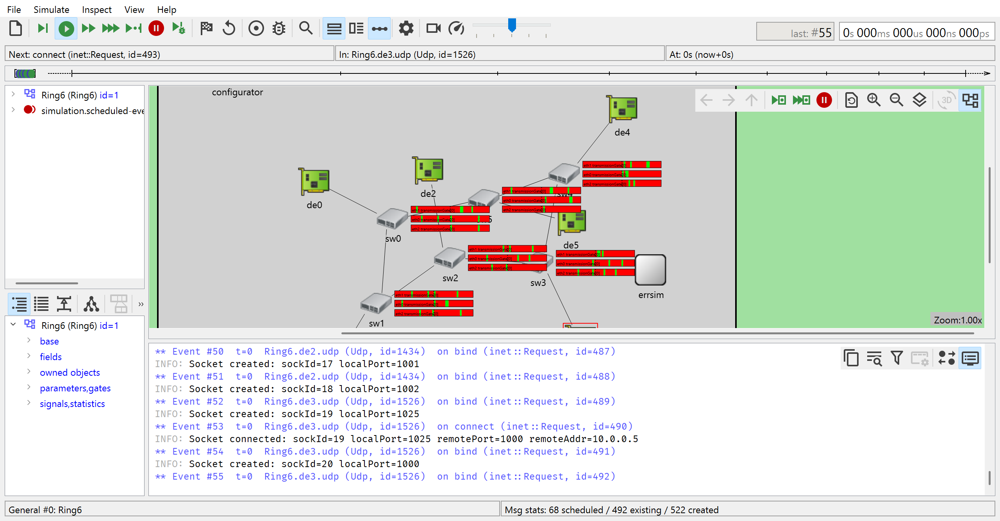

## TSNCard Network Simlation

### Environment

TSNCard network simulation is based on OMNeT++. Running simulations requires OMNeT++ `6.0.3` or later.

### Running a simulation

Running a TSNCard simulation requires 2 configuration files: network topology configuration (`*.ned`) and network dataflow configuration (`*.ini`). Example configuration files are places in `Simulation/simulations`.

To run a simulation, load `*.ned` in OMNeT++, configure it with `*.ini`, then start simulation. Raw log files will be stored under `log` folder. After simulation finishes, run `Simulation/log/log_analysis.py` to analyze log files and generate postcard-formed network log.

Then run TSNCard software to launch TSN error diagnosis.

### Network Error Simulation

We edit some of the standard components in OMNeT++ to support automatic network error simulation. Edited modules are placed in `Simulations/modules`.

Generated `*.ini` file contains automized error generation already. Error types include: short gate-open time, gate late open, gate early open, in-gate queue disorder, delayed packet delivery, and packet loss. Each of the errors occurs at a certain probability.

### Customize simulation network and flow

Simulation topology and dataflow could be automatically generated.

Edit `Simulation/topology_generation/main.py` then run it to generate `*.ned` and `*.ini` files.

Simulation could be customized by editing `GENERATION_CONFIG` in `main.py`. Topology type, number of devices, number of switches, number of flows and transmit period is editable. Currently 4 types of topology are available: `ring6`, `a380`, `cev` and `random`.

The generation program will randomly generate topology and dataflow, then schedule switch gates to satisfy transmission constraints.