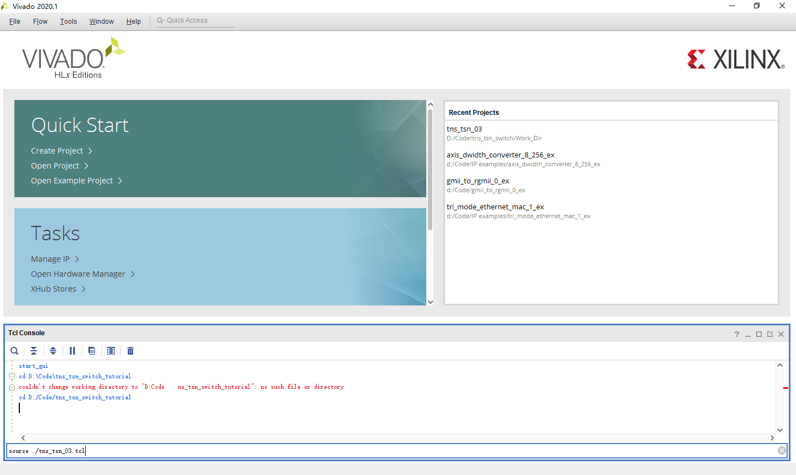
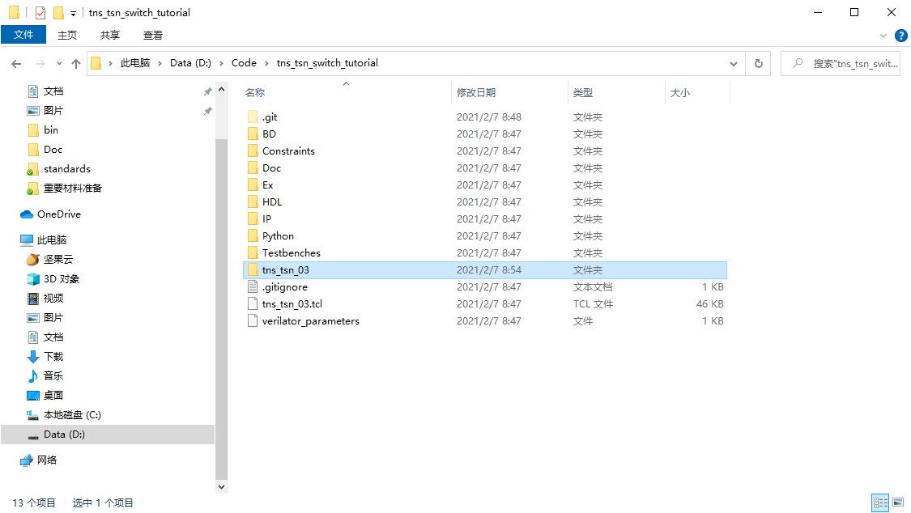
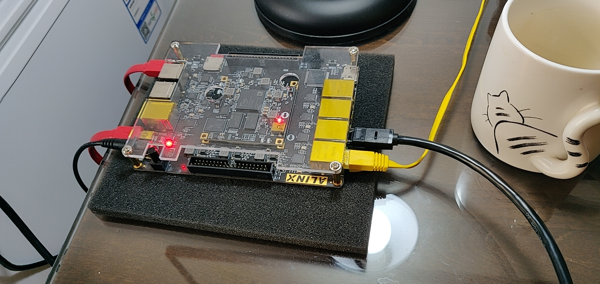
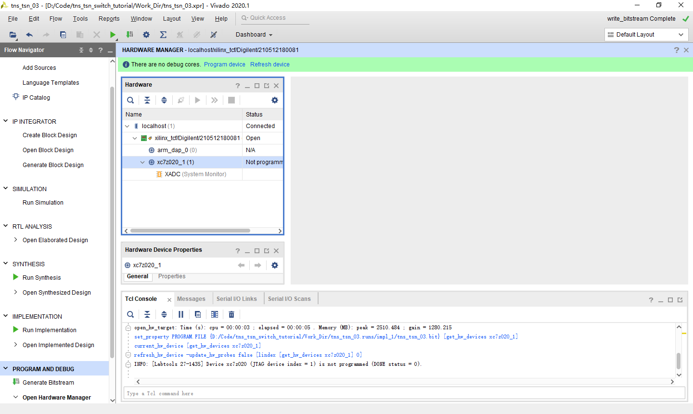
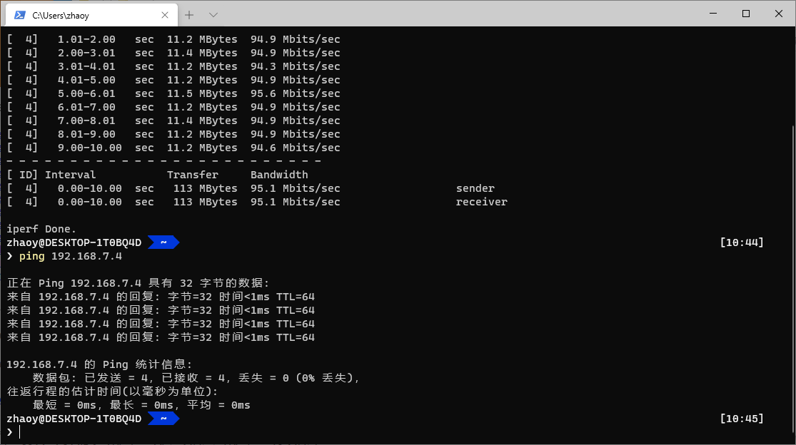
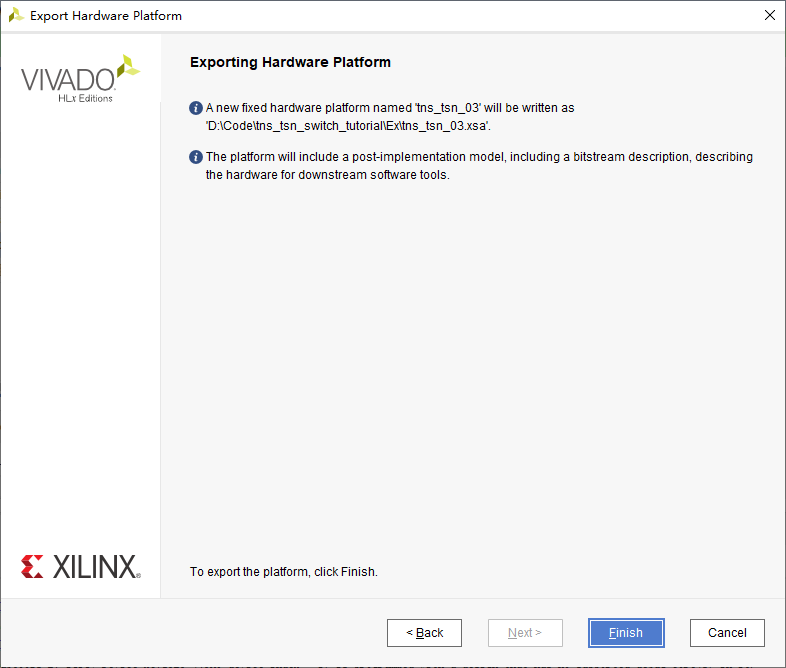

# Vivado Project Get Started
## 版本
2020.1

## 建立Vivado工程
1. 首先克隆硬件部分的git仓库：git@gitee.com:yizhao94/tns_tsn_switch.git，并切换到master分支。
2. 打开Vivado，在Tcl Console中输入命令 `cd Porject_dir`和`source ./tns_tsn_03.tcl`。命令执行完后，Vivado会自动打开创建的工程。这里我们先关闭Vivado，将工程所在的文件夹改名为Work_Dir，这样git才能正确的ignore掉这个目录，然后进入Work_Dir，双击.xpr文件再次打开工程。
 

3. 直接点击左侧最下面的Generate Bitstream，Vivado会执行综合、实现等一系列步骤，并生成最终的bitstream文件。时间可能会比较长，十几分钟，二十分钟吧。
4. 连接好FPGA

5. 烧录FPGA。在Vivado中Open Hardware Manager，点击auto connect小图标，右键xc7z020_1，Program Device。然后通过ping及iperf测试网络连通性。

6. 导出xsa文件。在Vivado中，File-Export-Export Hardware。Platform type选择fixed。Output选择include bitstream。如果想上传到git，导出位置就选择Ex文件夹，如果只是本地用，可以导出到Work_Dir中。点击Finish导出xsa文件。
