# 使用Vitis开发linux应用

## 1 设置SD卡启动FPGA

将`BOOT.bin`、`boot`、`image.ub`这三个文件拷贝到SD卡中，将SD卡插入FPGA，并将FPGA上的拨码开关SW1调到SD启动模式，这个开关位于开发板上一个圆孔的下方，很容易找到，如下图所示：

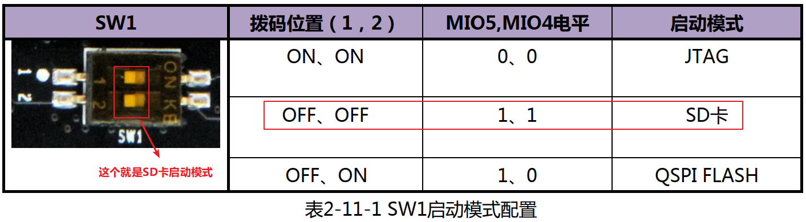

## 2 连接UART口和网口

1. 将开发板的UART口和网口分别和台式机连接，如图，其中红色的线连UART口

2. 更改台式机静态ip

打开"网络和Internet"设置

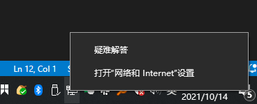

找到连接开发板的网口

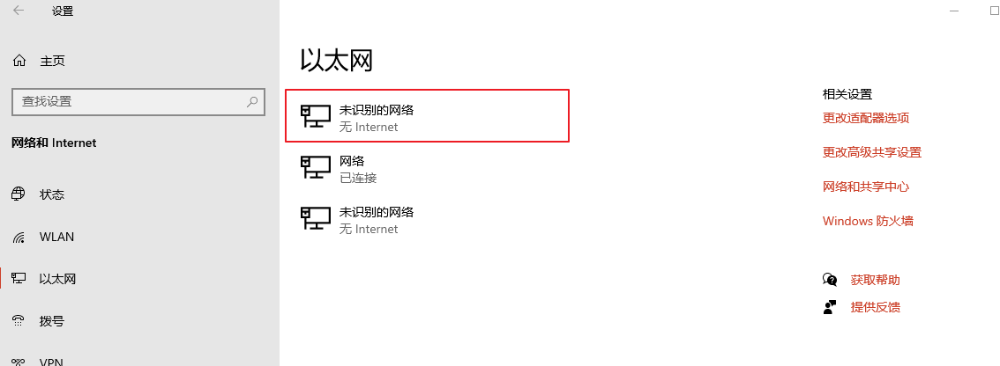

点击`编辑`，将台式机和开发板设置在同一个网段内

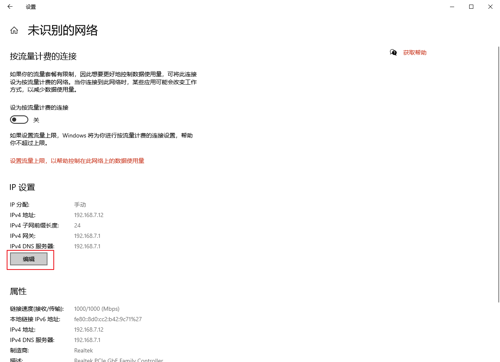

本教程中，开发板ip为：`192.168.7.11`，因此台式机对应网口静态ip设置如下：

ip: `192.168.7.12/24`

网关：`192.168.7.1`

DNS：`192.168.7.1`

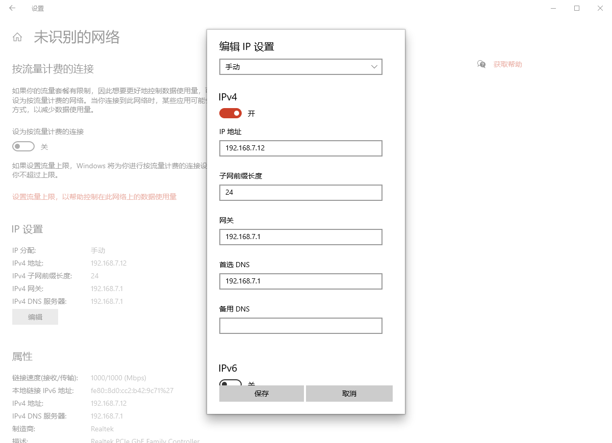

## 3 使用Vitis创建工程

1. 创建文件夹作为我们项目的工作区，比如本教程将工作区命名为`linux_workspace_2`，选择好工作区后，点`Launch`
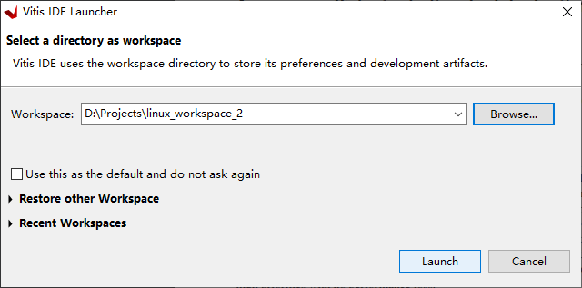
2. 点击`Create Application Project`创建应用项目
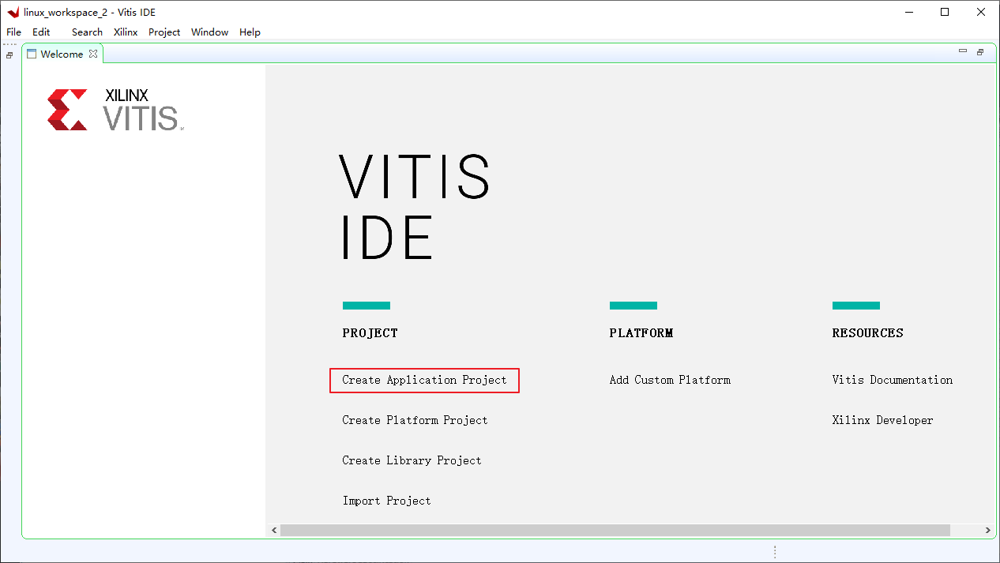
3. 点击`Next`
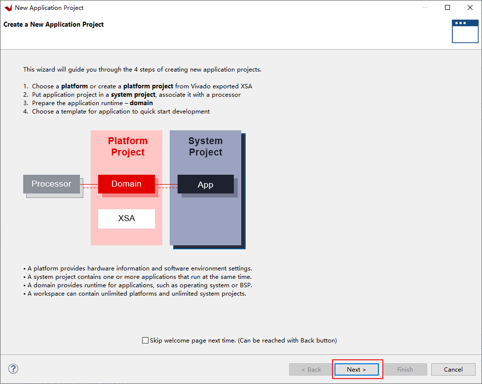
4. 点击`Create a new platform from hardware (XSA)`, 选择好`.xsa`文件，点击`Next`
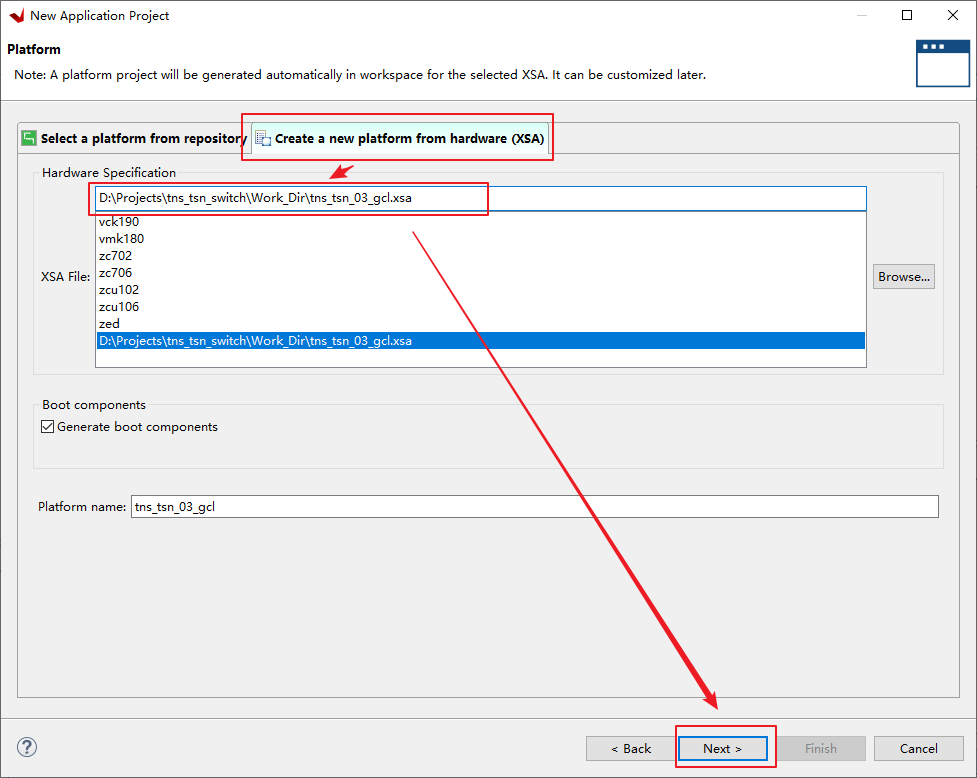
5. 在`Application project name`中给应用命名，本教程命名为`linux_app`，`Target processor`选择`ps7_cortexa9 SMP`，点击`Next`
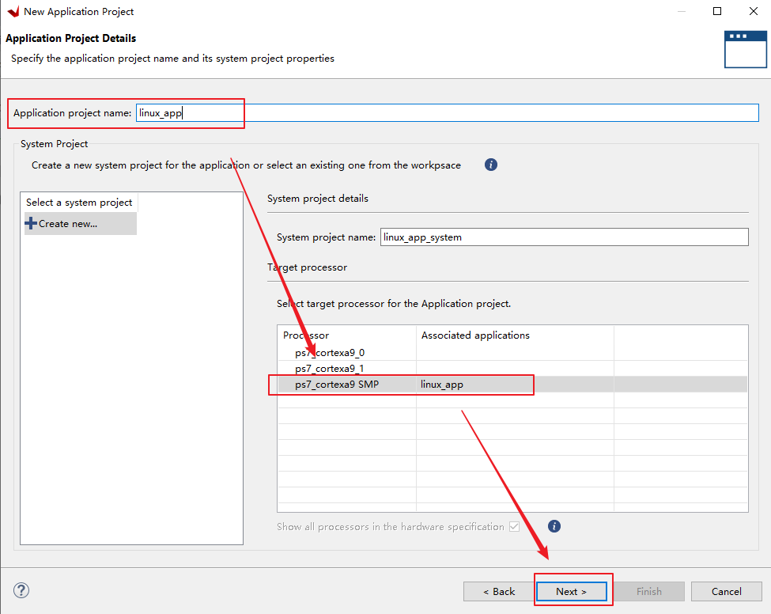
6. 点击`Next`
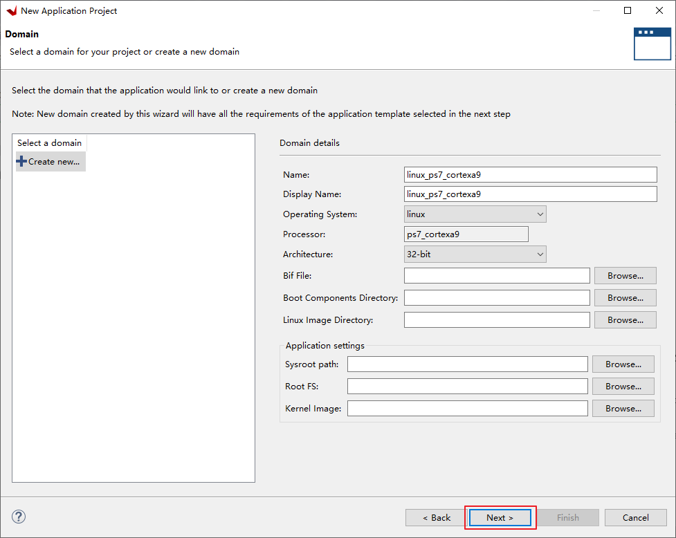
7. template选择`Linux Hello World`, 点击`Next`
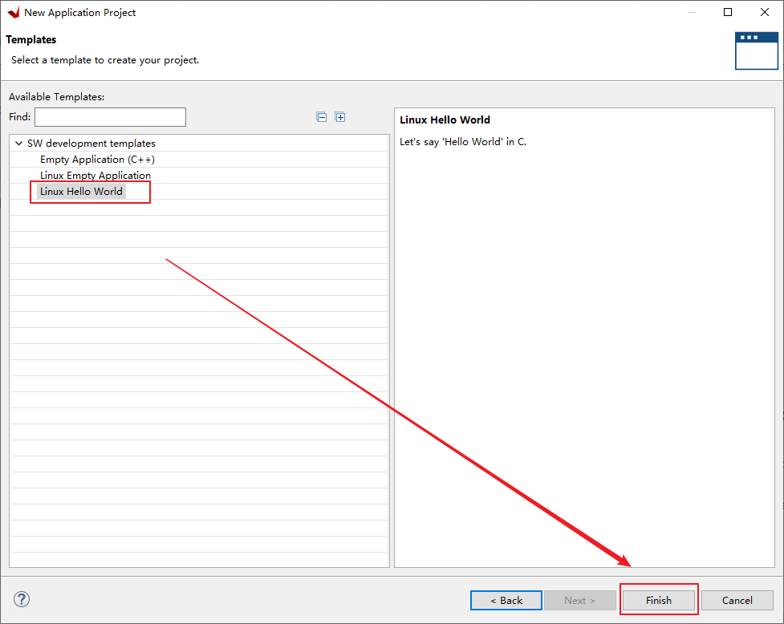
8. 右键`linux_app`，点击`Run As`->`Run Configuration`
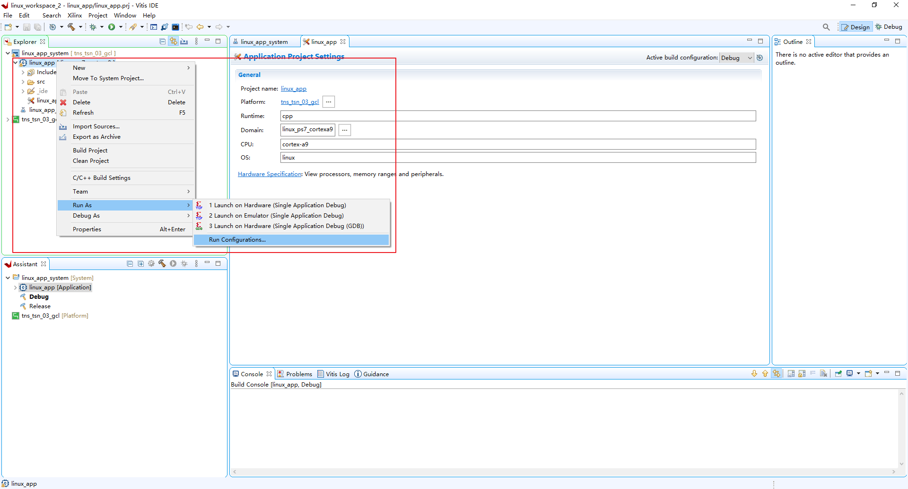
9. 双击`Single Application Debug`， 扩展界面打开，点击`Linux Agent`旁的`New`
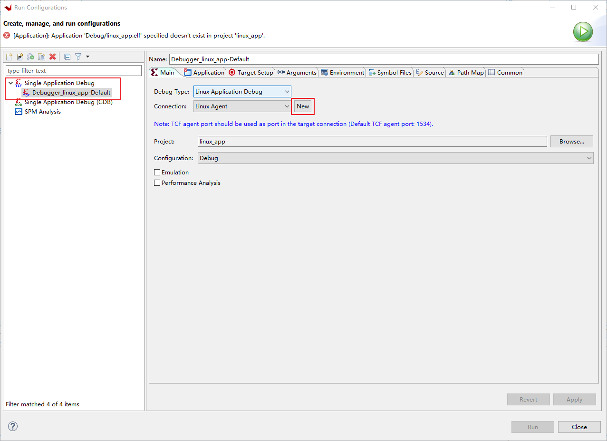
10. 在`Target Name`中对连接的Target进行命名。本教程命名为`my_target`，输入TCF agent ip和端口号（默认1534），本教程开发板主机ip为`192.168.7.11`，可以点击`Test Connect`看看是否连通，成功后点击`OK`
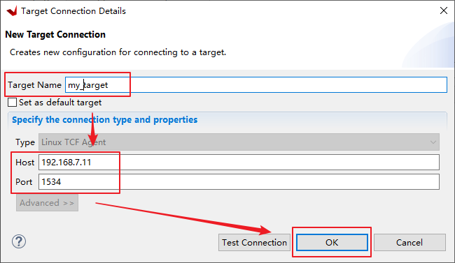
11. 测试`hello world`程序，选中`linux_app`，然后点击`build`图标，最后点击`run`图标
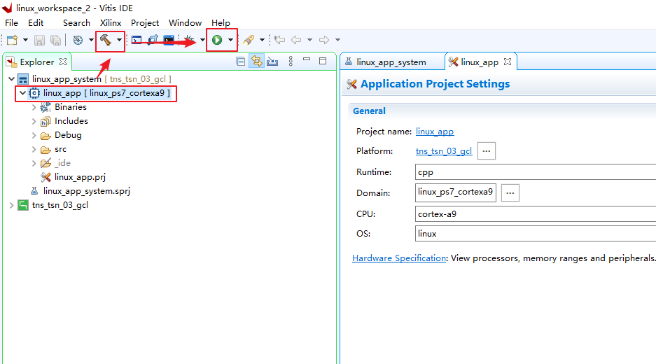
12. `Console`窗口会输出"hello world"， 说明成功
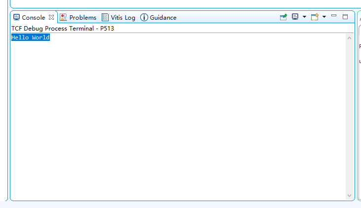

## 4. 台式机上显示开发板的终端

打开串口输出
1. 菜单栏中，点击`Window`->`Show view`
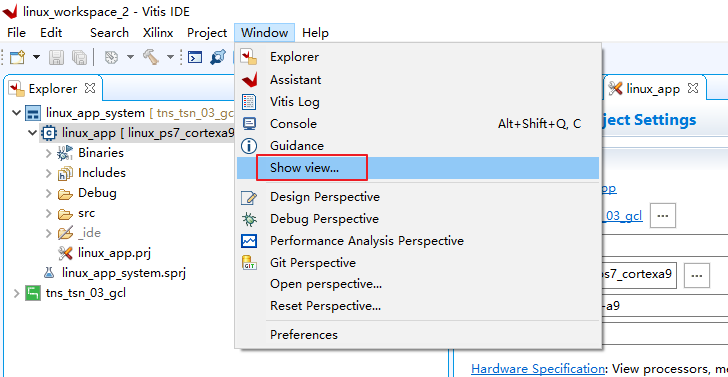
2. 选择`Terminal`->`Terminal`
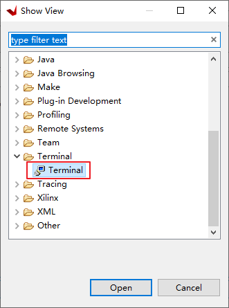
3. 点击这个显示器图标，进入`Launch Terminal`窗口
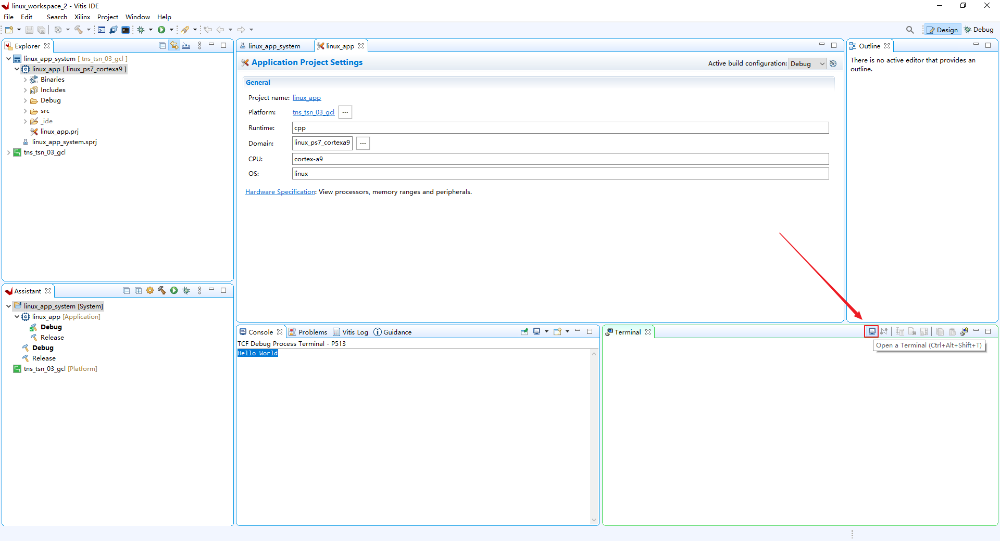
4. `Choose terminal`选择`Serial Terminal`，`Baud Rate`选择`115200`，点击`OK`
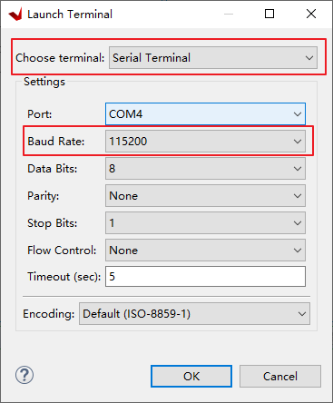
5. 连接成功，如果没显示东西可以回车一下试试，登录用户名和密码均为root
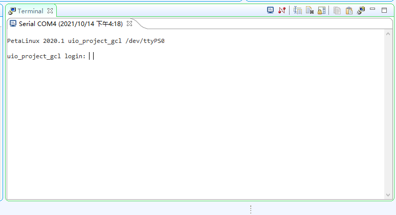