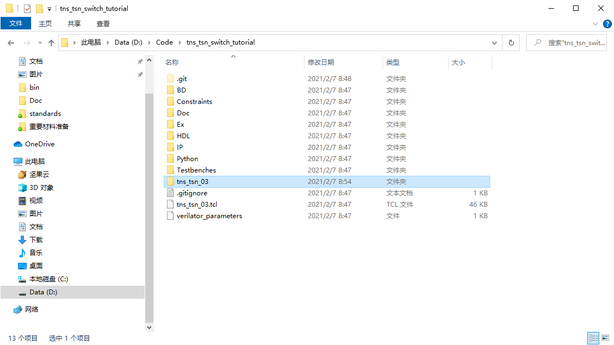
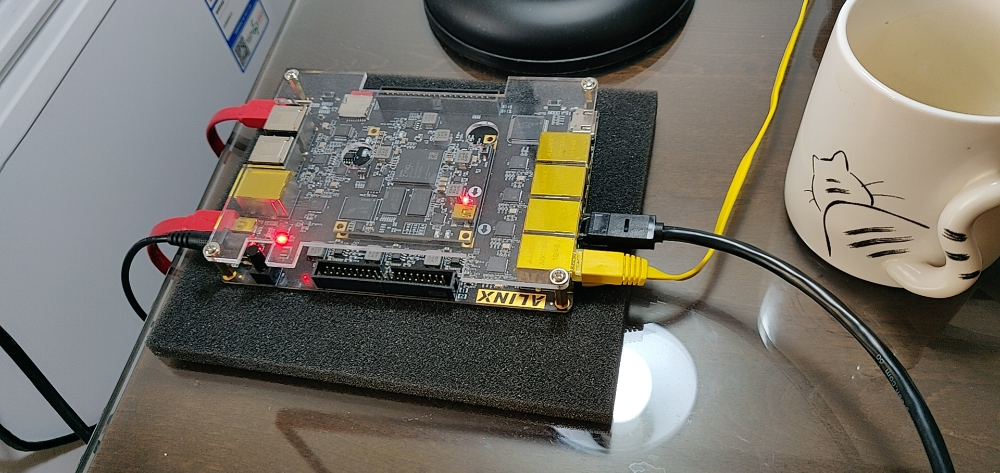
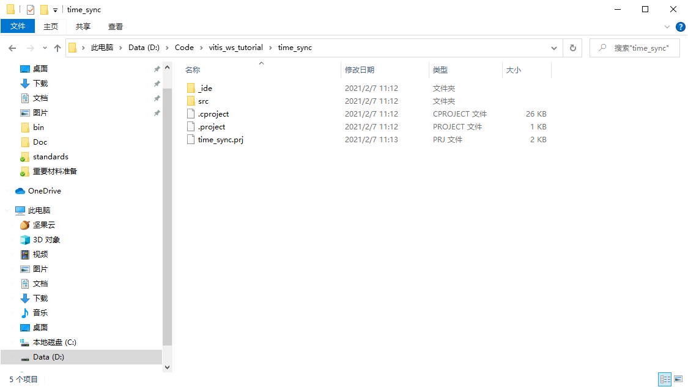

# 时间同步协议（802.1AS）开发手册
目前项目整体的开发流程是：
* 在Vivado中进行硬件开发，综合、实现、生成比特流后将硬件导出（Export Hardware），导出.xsa文件（1-7）。
* 将.xsa文件导入到vitis中进行PS部分的开发。

我们接下来主要进行PS部分开发，硬件部分应该基本不用动了，所以你也可以直接使用Ex文件夹中现成的xsa文件，直接从第8步开始。

## 版本
Vivado和Vitis的版本都是2020.1

## 建立Vivado工程
1. 首先克隆硬件部分的git仓库：git@gitee.com:yizhao94/tns_tsn_switch.git，并切换到802.1AS分支。
2. 打开Vivado，在Tcl Console中输入命令 `cd Porject_dir`和`source ./tns_tsn_03.tcl`。命令执行完后，Vivado会自动打开创建的工程。这里我们先关闭Vivado，将工程所在的文件夹改名为Work_Dir，这样git才能正确的ignore掉这个目录，然后进入Work_Dir，双击.xpr文件再次打开工程。
 
（家里显示器720p的，截图像素有点捉鸡）

3. 直接点击左侧最下面的Generate Bitstream，Vivado会执行综合、实现等一系列步骤，并生成最终的bitstream文件。时间可能会比较长，十几分钟，二十分钟吧。
4. 连接好FPGA

5. 在各个设备上设置网卡工作在100M full-duplex，Linux执行命令`sudo ethtool -s eth0 speed 100 duplex full`，windows在“更改适配器选项-网卡右键属性-配置-高级-Speed&Duplex”中设置。也要给每个网卡设置固定ip，例如192.168.7.x。

6. 烧录FPGA。在Vivado中Open Hardware Manager，点击auto connect小图标，右键xc7z020_1，Program Device。然后通过ping及iperf测试网络连通性。

7. 导出xsa文件。在Vivado中，File-Export-Export Hardware。Platform type选择fixed。Output选择include bitstream。如果想上传到git，导出位置就选择Ex文件夹，如果只是本地用，可以导出到Work_Dir中。点击Finish导出xsa文件。

## 建立Vitis工程（进行PS开发）
8. 打开vitis，点击Create Platform Project。可能需要自己先指定一个workspace目录，这个随意。项目名随意，选择“Create from hardware specification （XSA）”。选择我们刚才导出的或Ex文件夹里现成的xsa文件。Finish。

9. 在Explorer中右键新建的工程-Build Project。

10. 新建Application Project。在Vitis中File-New-Application Project。选择我们刚刚新建的platform。application project name随便写，然后next。domain就选standalone ……。Template选Hello World，然后Finish。

11. 来到新建application project的源代码处，就在一开始选择的workspace目录里。

12. 用从PS部分的git仓库克隆的代码替换src文件夹。

*注意：* 这里应该把文件复制过去，跳过相同内容，然后删掉 helloworld.c 文件。因为 platform 等配置可能随着硬件而变化了。
13. 在Vitis中，右键\<app project\>_system-Build Project。然后右键\<app project\>-Build Project。
14. 在Vitis中，选择Windows-Show View，搜索terminal，选择terminal-terminal。（FPGA有两条线，一条JTAG线用来烧录，一条UART线用来输出PS部分的打印信息）点击小图标open a terminal。参数配置如图。

15. 右键\<app project\>，Run as - Run Configurations，右键Single application debug - New Configuration，选中新建的Configuration，Run。

16. 跑的这个程序主要包括两个测试：RTC的测试和TSU的测试，可以阅读time_sync_main_loop.c中的函数RTCTest和TSUTest了解。其中TSUTest还需要PC端配合，在PC上使用xcap软件[link](http://xcap.weebly.com/)，制造PTP帧发送给交换机，交换机收到后会打印收到PTP帧的时间戳并返回一个PTP帧，同时也打印返回PTP帧的发送时间戳。xcap自造PTP帧的pcap文件在Doc/other/ptp.pcap目录下，可以右键xcap中的packet group选择read from .pcap file。

