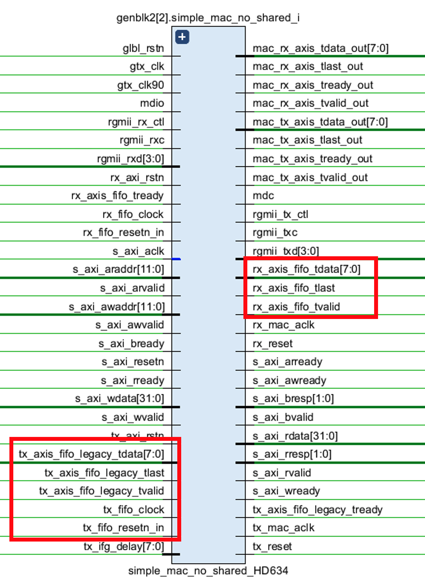
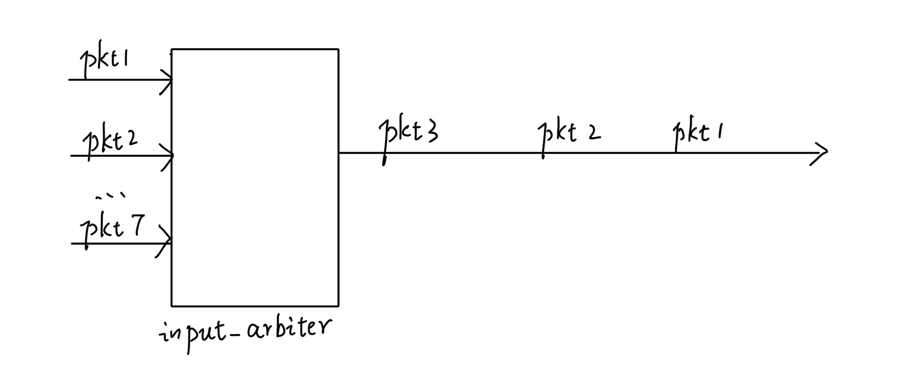
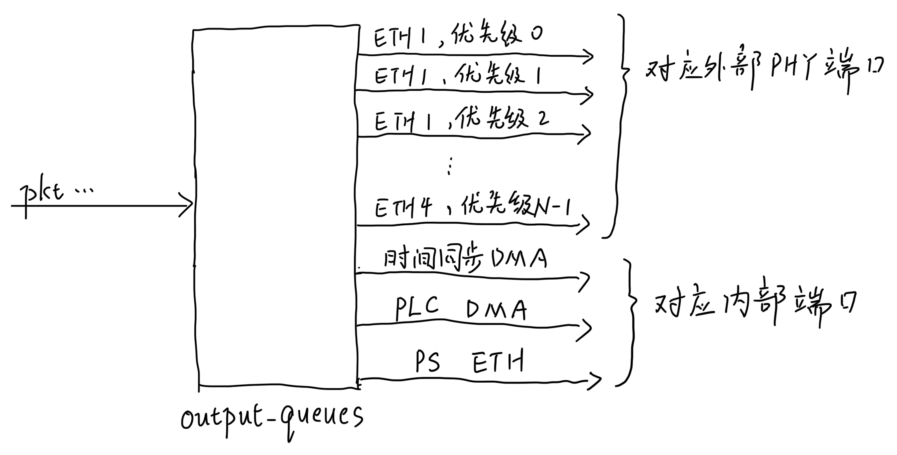
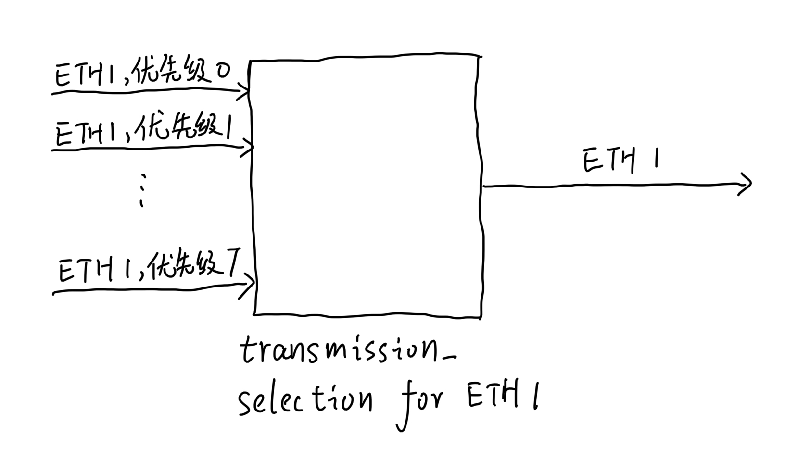

# 交换机设计
“交换”是交换机的核心功能，即从不同端口进入的数据包按照转发规则从不同的端口离开交换机。
交换机目前共有7个输入端口和7个输出端口，其中4个是外部物理端口，3个是交换机内部连接PL与PS部分的端口。
3个物理端口具体包括：
* 时间同步DMA：传输PTP数据帧。
* PLC DMA：CaaS中用来传输控制任务的输入输出。
* PS ETH：这个端口在PS中是一个网卡（eth1）。

目前这一设计并非最佳设计，PTP数据帧可以并入PS ETH传输。
如果能解决实时性问题，PLC DMA也可以并入PS ETH。

## 外部物理端口
外部PHY芯片采用rgmii协议。
tns_tsn_03.v是交换机的顶层模块，它的IO端口rgmii\*，phy_resetn，mdio和mdc信号连接4个PHY端口。
由于Verilog的模块端口不允许二维数组，所以，rgmii的txd与rxd信号都展开成了一维数组。

这4组rgmii接口被连接到了simple_mac_\*模块，这些模块的内部主要是tri_mode_ethernet ip核，他们将数据包从rgmii协议转成AXI Stream协议。如下图所示（有些信号不在一处，没有全部圈出，只圈出了主要信号），tx_axis_fifo_legacy\*传输的是离开交换机的数据包，rx_axis_fifo_\*是进入交换机的数据包。

## DATAPATH
datapath_v3模块是在输入和输出端口间交换数据包的模块，我们是基于NETFPGA项目的datapath进行开发的。
datapath模块连接有我们上述的7个端口（AXIS协议），对应的端口如下。

输入端（进入datapath）：
* 4个外部端口：s_axis_0/1/2/3_\*。
* 3个内部端口：
    * 时间同步DMA：s_axis_4_\*。
    * PLC DMA：s_axis_5_\*。
    * PS ETH：s_axis_6_\*。

输出端（离开datapath）：
* 4个外部端口：m_axis_0/1/2/3_\*。
* 3个内部端口：
    * 时间同步DMA：m_axis_cpu_\*。
    * PLC DMA：m_axis_plc_\*。
    * PS ETH：m_axis_6_\*。

以上命名有不一致之处，后续可以考虑统一一下。
下面我们介绍在datapath_v3内部，来自7个输入端口的数据包是如何被交换到7个输出端口的。

### input_arbiter_seven_ports
7个输入端口进入datapath之后接入到模块input_arbiter_seven_ports，这个模块的作用如下图所示，它把7个输入端口的数据包汇总成一条AXIS，以便后续模块对数据包进行一一处理。

这里我们计算一下数据包的速率，判断汇总成的一条AXIS是否会堵塞。data信号的位数是256，时钟频率是125MHz，所以数据传输的速率是32Gbps，而我们总共有7条输入端口，假设都是1Gbps，总共也只有7Gbps的数据流量，因此这里不会阻塞。

### configurable_output_port_lookup
数据包接下来进入configurable_output_port_lookup模块，这一模块根据数据包的目的地mac地址，判断数据包应该发往7个输出端口的哪一个，目的端口的信息存储在tuser信号中。

tuser是一个128bit的信号，它的含义如下：
* tuser[23:16]：用来表示数据包是从哪个物理端口进来的，这个信息在自学习转发规则时有用。0x01代表数据包来自端口ETH1（见AX7021开发板的标注），0x04代表数据包来自端口ETH2，0x10代表ETH3，0x40代表ETH4。需要注意的是，这一字段也被用来判断PTP数据包该发往哪个端口，这是因为PTP数据包的目的地mac地址都是相同的，因此需要额外的信息来制定PTP数据包的输出端口。
* tuser[31:24]：configurable_output_port_lookup判断出每个数据包该发往哪个端口后，将这一信息写入这一字段。这一字段共有8个bit，每个bit的含义是：

    [未使用][ETH4][PS ETH][ETH3][PLC DMA][ETH2][时间同步DMA][ETH1]

### output_queues_v3
模块output_queues_v3的作用如下图所示，它的作用于input_arbiter相反，input_arbiter是多通路汇总到一通路，output_queues的作用是一通路分成多通路，分配的依据则是configurable_output_port_lookup判断的输出端口以及数据包VLAN header中指定的优先级。
4个外部物理端口，每个端口都有N个不同的优先级队列（N最大等于8）。
因此output_queues_v3总共有4N+3条输出通道，每条通道对应一个缓冲队列。

### transmission_selection
transmission_selection模块共有四个，每个PHY端口对应一个，负责把该端口N个不同优先级的AXIS汇总成一条AXIS（如下图所示）。这里是实现802.1Qbv的地方，如果当前时刻是为关键流量预留的时间槽，那么transmission_selection中的GCL就会被配置成在当前时刻只有关键流量对应的优先级的AXIS信号被允许连接到汇总后的那一条AXIS上。

每个外部端口的N个AXIS信号经过transmission_selection之后，汇总成1条AXIS信号，总的来说，AXIS通道数从4N+3减少到4+3=7条，即datapath最终的7个输出端口。