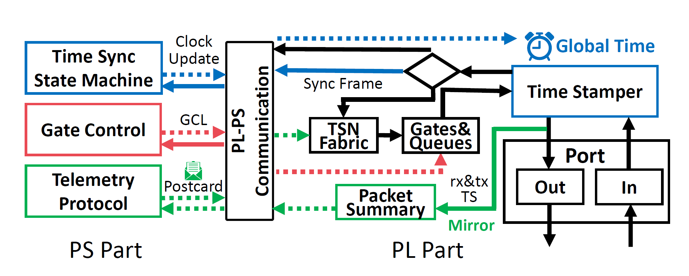

# Getting Start

## Folder Structure

```bash
.
├── docs               //documents for TSN Switch
├── figs               //figures for docs
├── hardware           //hareware code, for PL part(qbv forwarding, time sync in FPGA)
├── software           //software code, for PS part(time sync)
```


## System Design

TSN Switch is implemented on ZYNQ-7000 SoC and exploits ZYNQ's both hardware and software programmability. 



For more system design detail, please refer to [system-design.md](./system-design.md)


## Before Start

Getting TSN Switch up and running isn't exactly a walk in the park, so I'd recommend gauging your patience level before diving in. If you're feeling confident, double-check that you've got all the necessary software and hardware ready to go. (refer to [require.md](./require.md)) 


## Building and Starting the TSN Switch

TSN switch is a tool that requires tight coordination between hardware and software. First, we need to flash the hardware onto the FPGA board and initialize the system for it. Then, on that system, we'll run the program we've developed:

* [Set up the FPGA board and initialize PS system](hardware-build.md)

* [Compile software code, run the time synchronization](software-build.md)
