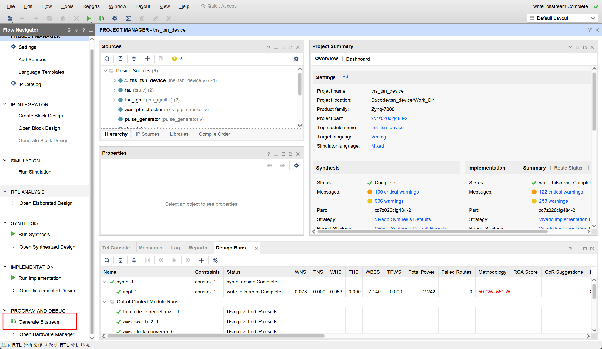
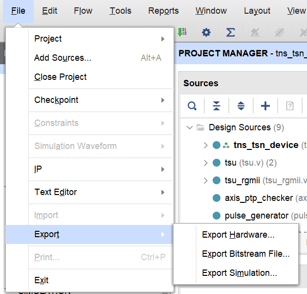

# Hardware: Build the CaaS Device

## Before Start

If you just want to teach the board to run instead of modifying it, and you use the hardware files we provide, you can skip directly to step [SD card partition and copy file](#6-sd-card-partition-and-copy-file). 

## Table of Content

- [Hardware: Build the CaaS Device](#hardware-build-the-caas-Device)
  - [Before Start](#before-start)
  - [Table of Content](#table-of-content)
  - [Install Vivado](#install-vivado)
  - [Vivado project construction](#vivado-project-construction)
  - [Petalinux](#petalinux)
    - [1.install ubuntu OS](#1install-ubuntu-os)
    - [2.Download PetaLinux related image files in advance](#2download-petalinux-related-image-files-in-advance)
    - [3.Activate the PetaLinux environment](#3activate-the-petalinux-environment)
    - [4.Create PetaLinux Project](#4create-petalinux-project)
    - [5.Petalinux Configuration](#5petalinux-configuration)
    - [6. SD card partition and copy file](#6-sd-card-partition-and-copy-file)
      - [File downloading](#file-downloading)
      - [SD card partition](#sd-card-partition)
      - [Copy files into SD card](#copy-files-into-sd-card)
  - [Launch the Board and log in](#launch-the-board-and-log-in)
    - [1. Launch the Board](#1-launch-the-board)
    - [2. Initialize PS](#2-initialize-ps)
    - [3. Connect to Internet](#3-connect-to-internet)
    - [4. Run the Software](#4-run-the-software)

## Install Vivado

You can download Vivado [here](https://www.xilinx.com/products/design-tools/vivado.html). 

We are using Vivado version 2020.1 (note: a unified version is required, otherwise running may cause problems).

## Vivado project construction

1. clone the git repository for the hardware part.
2. Open Vivado and enter the command `cd Porject_Dir` in Tcl Console and `source ./tsn_device.tcl`. After the command is executed, Vivado will automatically open the created project. Here, we will first close Vivado and rename the folder where the project is located to `Work_ Dir`, so that git can correctly ignore this directory and enter `Work_ Dir`, double-click the `.xpr` file to open the project again.


3. Click `Generate Bitstream`



4. Export the xsa file. In Vivado, File Export Export Hardware. Select Fixed for Platform type. Select include bitstream for Output. Click Finish to export the xsa file.
   
   Exported xsa file path: `Work_Dir/tns+tsn_device.xsa`

## Petalinux

### 1.install ubuntu OS

The following compilation processes are all completed within the virtual machine.

We recommend using the following configuration:

```
Virtual machine version: VMware Workstation 16 Pro
Ubuntu version: ubuntu-16.04.3-desktop-amd64.iso
```

### 2.Download PetaLinux related image files in advance

Enter website: https://www.xilinx.com/support/download/index.html/content/xilinx/en/downloadNav/embedded-design-tools/archive.html

Select 2020.1 to find `PetaLinux Tools sstate-cache artifacts` and download `sstate_ arm_ 2020.1` and `downloads` and save the downloads in a specified directory in the virtual machine on January 2021 (the directory for this document is set to/home/alinx/data/)

​    

### 3.Activate the PetaLinux environment

```bash
source /opt/pkg/petalinux/settings.sh
```

​    Automatically activate the PetaLinux environment every time Terminal is started.

### 4.Create PetaLinux Project

```bash
petalinux-create --type project --template zynq --name <project_name>
cd <project_name>
```

### 5.Petalinux Configuration

1. Import Hardware Configuration

```bash
petalinux-config --get-hw-description <PATH-TO-XSA Directory>
```

Then you will enter the menuconfig page and configure as follows:

```
Subsystem AUTO Hardware Settings
-> Ethernet Settings  
  -> [*] Randomise MAC address

Image Packaging Configurations 
-> Root filesystem type 
  -> [*] EXT4 (SD/eMMC/SATA/USB)

Yocto Settings (Use downloaded image)
-> Local sstate feeds settings: /home/alinx/data/sstate_arm_2020.1/arm
-> Add pre-mirror url: file:///home/alinx/data/downloads
```

2. make `Kernel Module`

​    make a module named "`dma proxy`":

```bash
petalinux-create -t modules -n dma-proxy --enable
```

​    replace the dma-proxy folder:

```bash
rm -rf project-spec/meta-user/recipes-modules/*
```

download our dma-proxy (from [here](https://cloud.tsinghua.edu.cn/f/85cfd8e8174e4689b79b/)) and unzip in `project-spec/meta-user/recipes-modules/`

3. Configuring the kernel

```bash
petalinux-config -c kernel
```

Entering the `menuconfig` page, and do:

```bash
Device Drivers 
-> Userspace I/O drivers 
  -> [*] Userspace I/O platform driver with generic IRQ handling 
  -> [*] Userspace platform driver with generic irq and dynamic memory 
  -> [*] Xilinx AI Engine driverDevice Drivers 
-> Dma Engine Support  
  -> [*] Xilinx DMA Engines
-> Network device support    
  -> Ethernet driver support        
    -> [*] Cadence devices        
    -> [*] Cadence MACB/GEM support

General setup 
-> Preemption Model    
  -> (X) No Forced Preemption (Server)
```

4. Configuring rootfs

Edit file `project-spec/meta-user/conf/user-rootfsconfig`, and ***add*** the following configuration:

```bash
CONFIG_sudo
CONFIG_sudo-dev
CONFIG_dnf
CONFIG_packagegroup-core-buildessential
CONFIG_packagegroup-core-buildessential-dev
CONFIG_packagegroup-self-hosted
CONFIG_packagegroup-self-hosted-dev
CONFIG_packagegroup-self-hosted-sdk-dev
CONFIG_packagegroup-self-hosted-sdk
CONFIG_python3
CONFIG_autoconf
CONFIG_autoconf-dev
CONFIG_automake
CONFIG_automake-dev
CONFIG_bison
CONFIG_bison-dev
CONFIG_flex
CONFIG_flex-dev
CONFIG_make
CONFIG_make-dev
CONFIG_python
CONFIG_libtool
CONFIG_libtool-dev
CONFIG_sqlite3
CONFIG_cmake
CONFIG_util-linux
CONFIG_net-tools
```

Save and exit.

Input:

```bash
petalinux-config -c rootfs
```

Then you will enter the menuconfig page and configure as follows:

```
Image Features 
-> [*] package management   
  -> (http://petalinux.xilinx.com/sswreleases/rel-v2020/feeds/zc702-zynq7/) Package feed url.
user packages
-> SELECT ALL
```

5. Compile the device tree

```
petalinux-build -c device-tree
```

6. Modify the device tree

The generated device tree is located in `components/plnx_workspace/device tree/device tree/pl.dtsi` directory, we need to make modifications based on this file to meet some of our peripheral needs. The modified files are stored in the `project-spec/meta user/recipes bsp/device tree/files/system-user.dtsi` directory.

> Note: Between the `//>>>` and `//<<<` is the content added between the comments.

```C
/include/ "system-conf.dtsi"
/ {
        amba_pl: amba_pl {
                dma_proxy {  
            compatible ="xlnx,dma_proxy";
            dmas = <&axi_dma_0 0  &axi_dma_0 1>;
            dma-names = "dma_proxy_tx", "dma_proxy_rx";  
        };
                pkt_gen_controller_0: pkt_gen_controller@43c00000 {
                        compatible = "generic-uio","uio";
                        reg = <0x43c00000 0x10000>;
                };
                rtc0: time_sync_uio@43c10000 {
                        compatible = "generic-uio","uio";
                        reg = <0x43c10000 0x10000>;
                };
        };
        chosen{
                        bootargs = "console=ttyPS0,115200 earlyprintk cma=256M uio_pdrv_genirq.of_id=generic-uio root=/dev/mmcblk0p2 rw rootwait";
      stdout-path = "serial0:115200n8";
        };
};
&gem1 {
    local-mac-address = [00 00 00 00 02 01];
    phy-mode = "gmii";
    fixed-link {
        speed = <1000>;
        full-duplex;
    };
};
```

7. Complie

```bash
petalinux-build
```

8. Pack

Here, you need to copy the bitstream file generated by Vivado to the virtual machine.  (You can export bitstream file to where you want).



Then:

```bash
cd images/linux
petalinux-package --boot --fsbl zynq_fsbl.elf --fpga <FPGA bitstream path> --u-boot --force
```

After that, you can get 4 key file: `BOOT.BIN` `boot.scr` `image.ub` `rootfs.tar.gz`

### 6. SD card partition and copy file

#### File downloading

Download the following file from [this](https://cloud.tsinghua.edu.cn/d/0bbc00543e5b4b82a6ea/) public link or from preceding steps:

* BOOT.BIN
* boot.scr
* image.ub
* rootfs.tar.gz

#### SD card partition

In order to boot the Device, you are supposed to have a micro SD card with >32GiB storage. Then use:

```bash
sudo apt-get install gparted
sudo gparted
```

Parition it into two partition below

* BOOT: store boot files from petalinux
  
  Free space preceding (MiB): 4
  
  New size (MiB): 500
  
  File system: fat32
  
  Label: BOOT

* ROOTFS: store debian system rootfs
  
  Free space preceding (MiB): 0
  
  Free space following (MiB): 0
  
  File system: ext4
  
  Label: ROOTFS

#### Copy files into SD card

Mound SD card:

```bash
sudo mount /dev/sda1 /media/alinx/BOOT/
sudo mount /dev/sda2 /media/alinx/ROOTFS/
```

Remove original files:

```bash
sudo rm -rf /media/alinx/BOOT/* /media/alinx/ROOTFS/*
```

Copy files:

```bash
sudo cp BOOT.BIN boot.scr image.ub /media/alinx/BOOT

sudo tar -zxvf rootfs.tar.gz -C /media/alinx/ROOTFS
sudo cp -r ~/init_os.sh /media/alinx/ROOTFS/home/root/init_os.sh 
sync
sudo chown root:root /media/alinx/ROOTFS
sudo chmod 755 /media/alinx/ROOTFS
```

## Launch the Board and log in

### 1. Launch the Board

Plug the SD card into FPGA board, turn the switch to SD card boot mode.


### 2. Initialize PS

Plug in SD card, setup AX7021 board to boot on SD, power on.

Connect a PC to the UART port of the board. We recommend using MobaXterm to connect the serial. Set up the Speed to 115200, Flow Control to None.


The default username and password are as follows:

```json
username: "root"
password: "root"
```

Execute the initilization script to set up the linux environment. (`hardware/init_os.sh`)

```bash
sh init_os.sh
```

You can freely configure the host name, IP address, and MAC address, etc with the script, and can modify the script if needed.

### 3. Connect to Internet

Connect the PC's network port to the device's **PS** network port (ETH0).

Set up PC's corresponding port to be in the same subnet with the device (i.e., 192.168.137.x).

Afterwards, you can connect to the device through `ssh` and copy any Software files needed.

### 4. Run the Software

Please refer to the [software part](./software-build.md) of this repo for further instructions.
